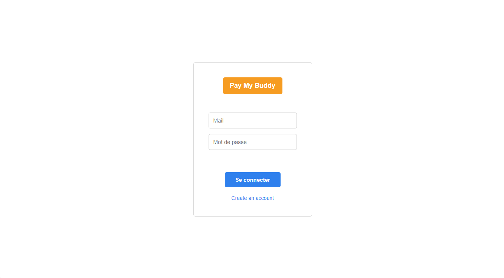
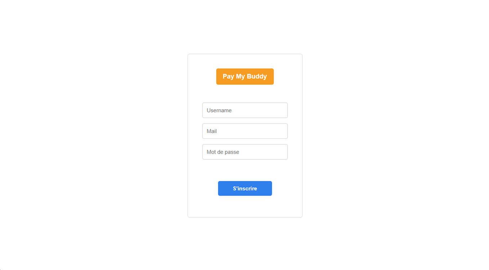
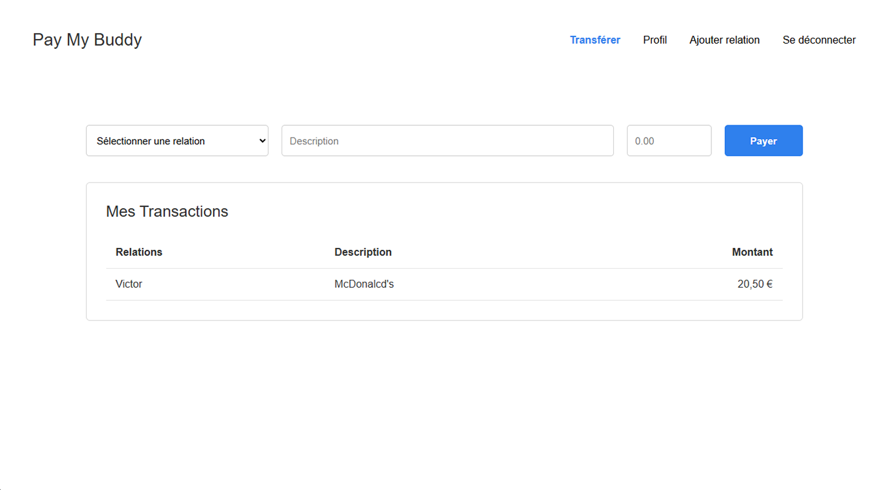
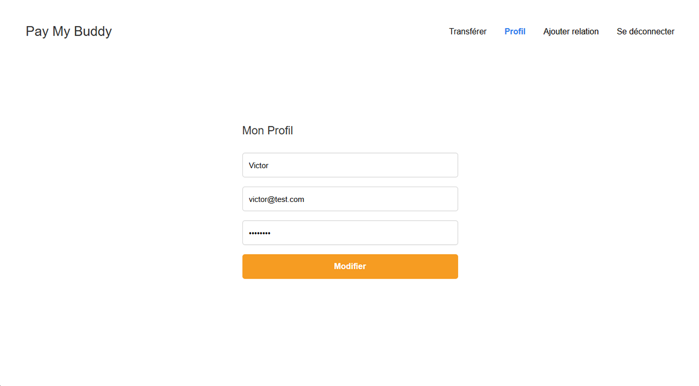
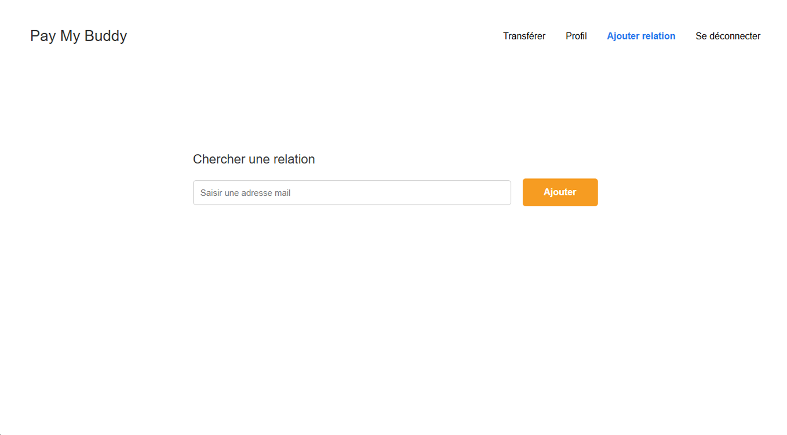

# 💸 Pay My Buddy

<p align="center">
  
</p>

<h3 align="center">
A Secure Money Transfer Web Application
</h3>

<p align="center">


</p>

> [!NOTE]
> This project was developed as part of the **OpenClassrooms – Java Application Developer** program.
> It demonstrates the implementation of a secure Spring Boot web application based on the MVC architecture using Spring Security, Spring Data JPA, Thymeleaf and comprehensive automated testing.

---

# 📖 Overview

**Pay My Buddy** is a secure web application that allows registered users to transfer money safely between trusted connections.

The application demonstrates:

- MVC architecture
- Spring Security authentication
- Business service layer
- Spring Data JPA persistence
- Thymeleaf server-side rendering
- Automated testing with JUnit 5, Mockito and JaCoCo

---

# ✨ Features

- Secure user registration
- User authentication
- Password encryption with BCrypt
- Profile management
- Trusted connections management
- Secure money transfers
- Transaction history
- Email uniqueness validation
- Duplicate connection prevention
- Self-connection prevention

---

# 🛠 Technologies

| Category | Technologies |
|-----------|--------------|
| Language | Java 21 |
| Framework | Spring Boot 4.1 |
| Web | Spring MVC |
| Security | Spring Security, BCrypt |
| Persistence | Spring Data JPA, Hibernate |
| Database | MySQL 8 |
| Template Engine | Thymeleaf |
| Frontend | HTML5, CSS3 |
| Testing | JUnit 5, Mockito, Spring Boot Test, Spring Security Test |
| Reports | JaCoCo, Maven Surefire Report |
| Build Tool | Maven |

---

# 🏗 Architecture

```text
Browser
    │
    ▼
Controller
    │
    ▼
Service
    │
    ▼
Repository
    │
    ▼
MySQL Database
```

Each layer has a single responsibility.

- Controllers handle HTTP requests.
- Services implement business logic.
- Repositories access the database.
- Entities represent the domain model.

---

# 📁 Project Structure

```text
src
├── main
│   ├── java
│   │   └── com.openclassrooms.paymybuddy
│   │       ├── configuration
│   │       ├── controller
│   │       ├── model
│   │       ├── repository
│   │       ├── security
│   │       └── service
│   └── resources
│       ├── static
│       ├── templates
│       └── application.properties
└── test
```

---

# 📸 Application Screenshots

<p align="center">
  
  
</p>

<p align="center">
  
  
</p>

<p align="center">
  
</p>

---

# 📂 UML Documentation

The project documentation is available in the **docs** directory.

- Use Case Diagram
- Class Diagram
- Physical Data Model (MPD)

---

# 🗄 Database

Create the database:

```sql
CREATE DATABASE paymybuddy
CHARACTER SET utf8mb4
COLLATE utf8mb4_unicode_ci;
```

Then import the provided SQL script.

---

# ⚙ Configuration

Configure your database in:

```text
src/main/resources/application.properties
```

Example:

```properties
spring.datasource.url=jdbc:mysql://localhost:3306/paymybuddy
spring.datasource.username=root
spring.datasource.password=your_password
```

---

# ▶ Installation

Clone the repository:

```bash
git clone https://github.com/r-fialka/rouslan-fialkouski-application-spring-security.git
```

Enter the project:

```bash
cd paymybuddy
```

Install dependencies:

```bash
mvn clean install
```

---

# ▶ Running the Application

```bash
mvn spring-boot:run
```

---

# 🧪 Running Tests

```bash
mvn clean verify
```

This command:

- executes all unit tests;
- runs MVC tests;
- runs Spring Security tests;
- generates the JaCoCo report;
- generates the Maven Surefire report.

---

# 📊 Test Coverage

Coverage reports:

**JaCoCo**

```text
target/site/jacoco/index.html
```

**Surefire**

```text
target/reports/surefire.html
```

---

# 🚀 Future Improvements

- REST API
- Docker support
- GitHub Actions CI/CD
- Email notifications
- Pagination
- Transaction search
- User avatars
- Role-based authorization
- Internationalization (i18n)

---

# 👤 Author

**Rouslan Fialkouski**

OpenClassrooms

Project 6 – Pay My Buddy

---

# 📄 License

This project is distributed under the MIT License.